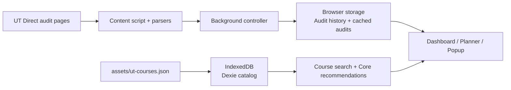

<div align="center">
  
  <h1>Degree Audit Plus</h1>
  <p>A clearer, more useful way to read and plan a UT Austin degree audit.</p>
  <p>
    <a href="https://github.com/Longhorn-Developers/Degree-Audit-Plus">Repository</a>
    ·
    <a href="docs/architecture.md">Architecture</a>
    ·
    <a href="LICENSE">MIT License</a>
  </p>
</div>

## What is a degree audit?

A degree audit compares your completed, in-progress, and planned coursework with the requirements for your degree, major, minor, or certificate. It answers the practical question: **what is done, what is in progress, and what is left?**

Degree Audit Plus reads that information from UT Austin's UT Direct audit system and turns the dense results page into an interactive dashboard for understanding progress and building a semester plan.

## What you can do

- **See progress at a glance** — degree-completion donut, requirement progress bars, GPA totals, credit-hour totals, and major/minor labels.
- **Expand every requirement** — inspect completion status, remaining hours or courses, grades, semesters, and the courses counted toward each rule.
- **Manage audit history** — view cached audits in the popup, open a selected audit, rename it, and sync uncached results in the background.
- **Plan by semester** — switch between Audit and Planner views, drag eligible courses between semesters, and add future semesters.
- **Find courses easily** — search a bundled UT course catalog by text, department, and lower/upper division.
- **Get Core recommendations** — surface catalog courses that match recognized UT Core Curriculum requirements and add them as planned courses.
- **Keep your preferences** — sidebar state, view mode, selected audit, and light/dark mode persist in the browser.
- **Enter from UT Direct** — an inline banner on the audit landing page opens the enhanced experience.
- **Stay in the UT workflow** — the extension can open UT Direct, run a new audit, detect expired sessions, and refresh audit data without a Degree Audit Plus account.

**Stack:** React · TypeScript · Tailwind CSS · WXT/Vite · Dexie/IndexedDB · dnd-kit · Bun

## Architecture

The extension is organized around feature-owned modules with strict one-way dependencies. We follow a deep module style of software design to "hide" logic. Audit state and persistence are the shared seam; the dashboard, planner, popup, and course search consume that state rather than maintaining competing copies.



The main folders are:

```text
entrypoints/              WXT background, content, popup, and audit-page entrypoints
features/audit/           Audit state, persistence, calculations, and mutations
features/audit-scraping/  UT Direct parsing, session-aware scraping, and sync
features/dashboard/      Progress dashboard and navigation UI
features/planner/         Semester planning and drag-and-drop behavior
features/course-search/   Catalog search, recommendations, and add-course flow
features/catalog/         Bundled catalog, Dexie schema, and catalog tooling
domain/                   Framework-free application types and semester helpers
components/               Shared UI primitives and application components
tests/                    Parser, catalog, audit, and controller coverage
```

See [`docs/architecture.md`](docs/architecture.md) for the full dependency graph and runtime flows. ESLint enforces the documented feature boundaries.

## Local development

### Requirements

- [Bun](https://bun.sh/) — the version family is declared in [`mise.toml`](mise.toml)
- A Chromium- or Firefox-based browser
- A UT Direct session for testing real audit data

### Run the extension locally

```bash
bun install
bun run dev
```

Then open `chrome://extensions`, enable **Developer mode**, choose **Load unpacked**, and select:

```text
.output/chrome-mv3
```

For Firefox, use `bun run dev:firefox` and load the generated Firefox output.

### Useful commands

| Command                    | Purpose                                       |
| -------------------------- | --------------------------------------------- |
| `bun run dev`              | Watch and rebuild the Chrome extension        |
| `bun run dev:firefox`      | Watch and rebuild the Firefox extension       |
| `bun run build`            | Create a production Chrome build              |
| `bun run build:firefox`    | Create a production Firefox build             |
| `bun run compile`          | Type-check the project                        |
| `bun run lint`             | Run ESLint, including architecture boundaries |
| `bun test`                 | Run the test suite                            |
| `bun run format:check`     | Check Prettier formatting                     |
| `bun run catalog:validate` | Validate the bundled catalog data             |

To refresh the catalog during development:

```bash
bun run catalog:refresh
bun run catalog:validate
```

## Future directions

| Area                        | Direction                                                                          |
| --------------------------- | ---------------------------------------------------------------------------------- |
| Major-aware recommendations | Tailor course suggestions to a student’s major, minor, and remaining requirements. |
| Richer planning tools       | Improve the semester-planning interface and make long-term plans easier to manage. |
| Advisor collaboration       | Support safe audit sharing or export for review with academic advisors.            |
| Multi-audit support         | Compare and combine audits for multiple programs, minors, or planning scenarios.   |

## Contributing

### 1. Set up the repository

```bash
git clone https://github.com/Longhorn-Developers/Degree-Audit-Plus.git
cd Degree-Audit-Plus
bun install
```

### 2. Run the extension

Start the WXT development build:

```bash
bun run dev
```

Load `.output/chrome-mv3` as an unpacked extension from `chrome://extensions`. See [Local development](#local-development) for Firefox and browser setup details.

### 3. Make a focused change

```bash
git switch -c feat/short-description
```

Keep changes within the feature that owns the behavior. Avoid unrelated refactors, new abstractions for one-off logic, and unnecessary dependencies. Update tests and documentation when behavior or setup changes. Do not commit `.output/`, `.wxt/`, dependencies, secrets, or personal UT Direct data.

### 4. Verify before submitting

```bash
bun run format:check
bun run compile
bun run lint
bun test
```

For UI changes, manually verify the affected surface in the unpacked extension and include a screenshot or short recording in the pull request when useful.

### 5. Commit and open a pull request

Use [Conventional Commits](https://www.conventionalcommits.org/):

```bash
git add README.md path/to/changed-files
git commit -m "feat: improve audit planner"
git push -u origin feat/short-description
```

Open a pull request against `main`. A good PR includes:

- A short summary of the problem and solution
- Tests and commands run
- Screenshots for visual changes
- Known limitations or follow-up work

Keep pull requests small enough to review. CI checks formatting, types, lint rules, tests, and the production build before merge.


## License and Team

Degree Audit Plus is released under the [MIT License](LICENSE).

This is an independent, student-led project by [Longhorn Developers](https://github.com/Longhorn-Developers). It is not affiliated with or endorsed by The University of Texas at Austin. Always confirm your academic plan with your academic advisor.
