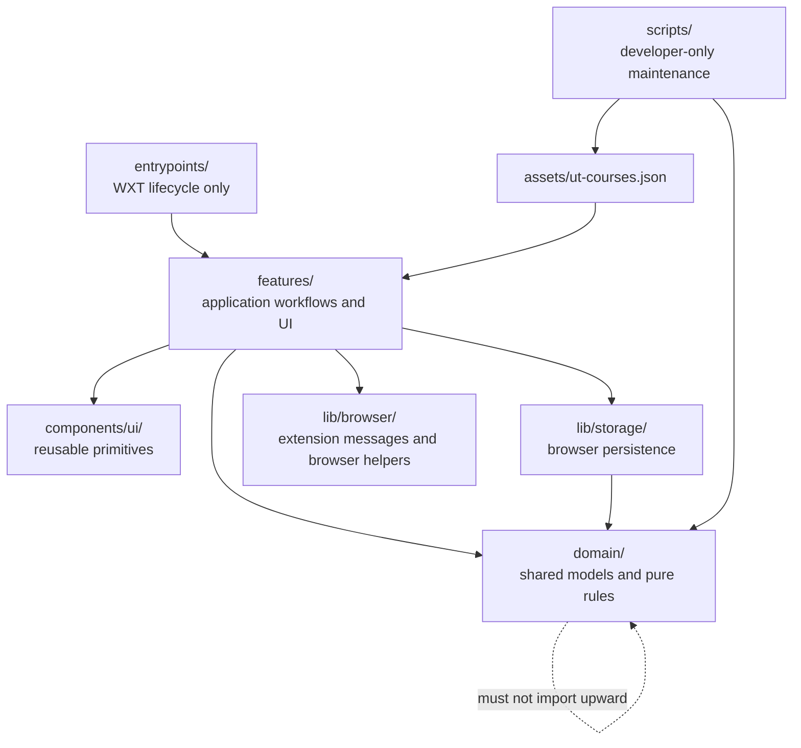
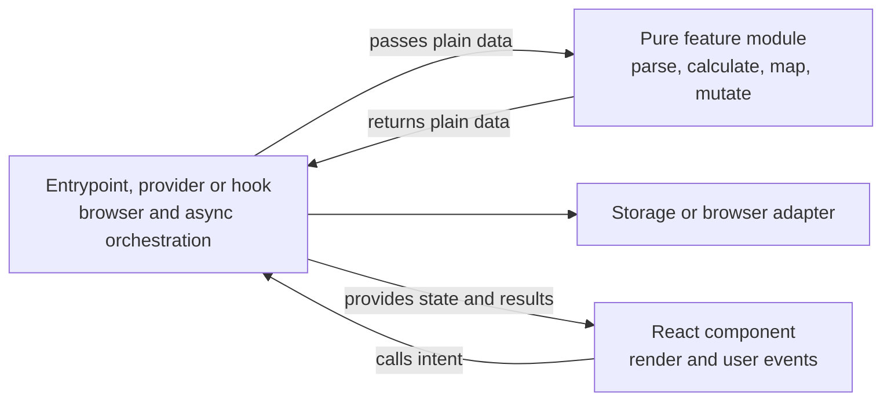
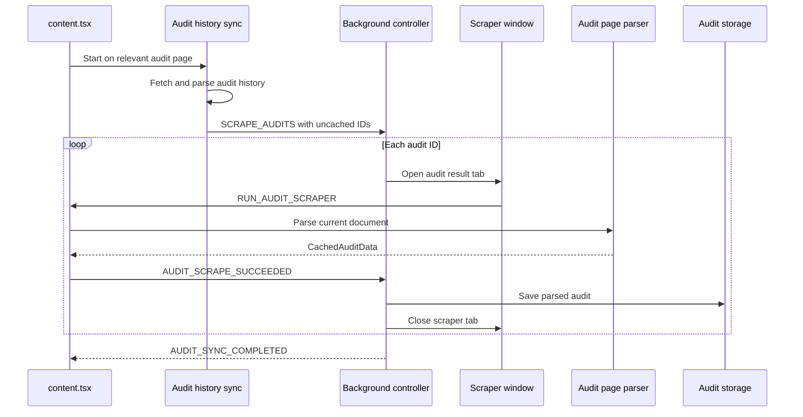
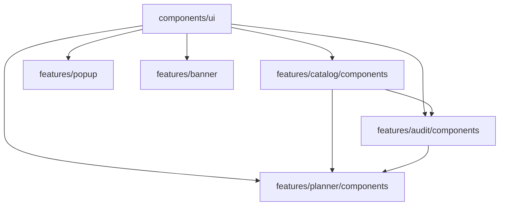
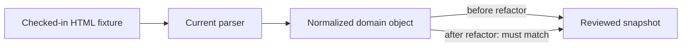

The catalog scraper should remain, but as a first-class developer workflow—not commented code inside the production audit content script.

Assumptions:

- Catalog refresh is run intentionally by developers, not automatically for extension users.
- `assets/ut-courses.json` remains the bundled source used to seed IndexedDB.
- The restructuring should preserve behavior and UI.
- We should avoid a new `src/` root because it would create broad churn without improving boundaries.

## Proposed architecture



The central rule is that dependencies only point downward:

- Entrypoints know about features.
- Features know about domain, storage and reusable UI.
- Domain knows nothing about React, WXT, DnD, storage or browser APIs.
- Developer scripts never run as part of the extension.

## Target code structure

```text
Degree-Audit-Plus/
├── assets/
│   ├── ut-courses.json
│   ├── noise-texture.svg
│   └── svgs/
│
├── components/
│   └── ui/
│       ├── button.tsx
│       ├── dropdown.tsx
│       ├── select-dropdown.tsx
│       ├── stack.tsx
│       ├── text.tsx
│       └── container.tsx
│
├── domain/
│   ├── audit.ts
│   ├── catalog.ts
│   ├── course.ts
│   └── progress.ts
│
├── entrypoints/
│   ├── background.ts
│   ├── content.tsx
│   ├── popup-ui.content.tsx
│   └── degree-audit/
│       ├── index.html
│       └── main.tsx
│
├── features/
│   ├── audit/
│   │   ├── components/
│   │   │   ├── audit-card.tsx
│   │   │   ├── degree-audit-page.tsx
│   │   │   ├── degree-completion-donut.tsx
│   │   │   ├── gpa-credit-cards.tsx
│   │   │   ├── requirement-breakdown.tsx
│   │   │   ├── requirement-row.tsx
│   │   │   ├── sidebar.tsx
│   │   │   └── unified-degree-card.tsx
│   │   ├── audit-calculations.ts
│   │   ├── audit-reducer.ts
│   │   ├── requirement-progress.ts
│   │   └── audit-provider.tsx
│   │
│   ├── audit-scraping/
│   │   ├── audit-page-parser.ts
│   │   ├── audit-history-parser.ts
│   │   ├── audit-history-sync.ts
│   │   ├── content-controller.ts
│   │   ├── background-controller.ts
│   │   └── scraper-window.ts
│   │
│   ├── catalog/
│   │   ├── components/
│   │   │   ├── course-search-panel.tsx
│   │   │   ├── course-search-results.tsx
│   │   │   └── course-add-modal.tsx
│   │   ├── scraping/
│   │   │   └── catalog-parser.ts
│   │   ├── catalog-db.ts
│   │   ├── catalog-course-mappers.ts
│   │   ├── catalog-search.ts
│   │   └── seed-catalog.ts
│   │
│   ├── planner/
│   │   ├── components/
│   │   │   ├── course-card.tsx
│   │   │   ├── semester-card.tsx
│   │   │   └── semester-dropdowns.tsx
│   │   └── degree-planner-page.tsx
│   │
│   ├── banner/
│   │   └── try-dap-banner.tsx
│   │
│   └── popup/
│       ├── popup-app.tsx
│       └── popup-audit-card.tsx
│
├── lib/
│   ├── browser/
│   │   └── messages.ts
│   └── storage/
│       ├── audit-storage.ts
│       ├── composite-storage.ts
│       └── preferences-storage.ts
│
├── scripts/
│   └── catalog/
│       ├── refresh-catalog.ts
│       ├── generate-department-map.ts
│       └── validate-catalog.ts
│
└── tests/
    ├── fixtures/scraping/
    │   ├── audit-page.html
    │   ├── audit-history.html
    │   └── catalog-page.html
    └── scraping/
        ├── __snapshots__/
        ├── audit-page-parser.test.ts
        ├── audit-history-parser.test.ts
        └── catalog-parser.test.ts
```

This is a target structure, not a requirement to create every file immediately. Files should only be introduced when existing code moves into them.

## Ownership map

| Concern                       | Target owner                                       | Notes                                                        |
| ----------------------------- | -------------------------------------------------- | ------------------------------------------------------------ |
| WXT configuration and startup | `entrypoints/`                                     | Thin registration/composition only                           |
| Audit DOM parsing             | `features/audit-scraping/audit-page-parser.ts`     | Pure functions receiving DOM elements                        |
| Audit-history parsing         | `features/audit-scraping/audit-history-parser.ts`  | Separate fetching from HTML parsing                          |
| Background batch queue        | `features/audit-scraping/background-controller.ts` | Queue, timeout, completion and tab cleanup                   |
| Content-script workflow       | `features/audit-scraping/content-controller.ts`    | Message handling and page detection                          |
| Catalog parsing               | `features/catalog/scraping/catalog-parser.ts`      | Reuses the existing required scraper                         |
| Catalog refresh               | `scripts/catalog/refresh-catalog.ts`               | Explicit developer command                                   |
| Catalog runtime search        | `features/catalog/catalog-search.ts`               | IndexedDB queries and recommendation rules                   |
| Persistence                   | `lib/storage/`                                     | Split by stored entity                                       |
| Runtime messages              | `lib/browser/messages.ts`                          | Typed request/result protocol                                |
| Business models               | `domain/`                                          | No UI or framework dependencies                              |
| Reusable UI                   | `components/ui/`                                   | Only genuinely cross-feature primitives                      |
| UI orchestration              | Feature providers, hooks and controllers           | Loads data and invokes pure operations for components        |
| Pure feature logic            | Non-React feature modules                          | Exports parsing, mapping, calculation and mutation functions |

## Logic and UI boundaries

The proposed structure includes a logic/UI split, but the files should be named for their responsibility rather than `importer` and `exporter`. Every TypeScript module can import and export; those names would describe syntax rather than ownership.

Use three roles where a feature is complex enough to need them:



Examples:

| Current mixed file          | UI owner                        | Logic owner                                                  | Orchestration owner                                      |
| --------------------------- | ------------------------------- | ------------------------------------------------------------ | -------------------------------------------------------- |
| `course-add-modal.tsx`      | Catalog modal/search components | `catalog-course-mappers.ts`, `catalog-search.ts`             | A focused course-search hook or the existing provider    |
| `requirement-breakdown.tsx` | Requirement cards and rows      | `requirement-progress.ts`                                    | `audit-provider.tsx` only where shared state is required |
| `audit-provider.tsx`        | Provider boundary only          | `audit-reducer.ts`, audit mutation and calculation functions | Provider effects call storage and dispatch results       |
| `content.tsx`               | Banner mounting only            | Audit/history parsers                                        | `content-controller.ts`                                  |
| `background.ts`             | No React UI                     | Queue state transitions where they can be pure               | `background-controller.ts` owns browser events           |

Keep small display-only components self-contained. Do not create a hook, controller or logic file for a one-use expression. Extract logic when it is complex, reused, independently testable, or currently couples UI to storage/browser APIs.

UI components may import pure formatting and calculation helpers. They should not directly import IndexedDB, browser storage, runtime messaging or scraper-window management unless the component itself is the explicit application boundary.

## Runtime audit scraping

The parser and orchestration should remain separate.



### What remains in `entrypoints/content.tsx`

Only lifecycle-specific work:

```ts
export default defineContentScript({
  matches: ["https://utdirect.utexas.edu/apps/degree/audits/*"],
  cssInjectionMode: "ui",
  main: startAuditContentScript,
});
```

### What remains in `entrypoints/background.ts`

Only registration:

```ts
export default defineBackground(() => {
  registerNavigationHandlers();
  registerAuditScrapingHandlers();
});
```

The background controller can still use browser tabs and windows. Those APIs are part of its responsibility. It should not contain DOM parsing.

## Course catalog refresh workflow

The catalog workflow should be completely separate from student audit scraping.

```mermaid
flowchart LR
    Command["bun run catalog:refresh<br/>--semester 20269"]
    Runner["refresh-catalog.ts<br/>departments, concurrency, progress"]
    Fetch["Fetch schedule pages<br/>and course detail pages"]
    Parser["catalog-parser.ts<br/>HTML → CatalogCourse[]"]
    Validate["validate-catalog.ts<br/>schema, duplicates, semester"]
    Temp["Temporary JSON"]
    Asset["assets/ut-courses.json"]
    Seed["seed-catalog.ts"]
    DB[("IndexedDB")]

    Command --> Runner
    Runner --> Fetch
    Fetch --> Parser
    Parser --> Validate
    Validate --> Temp
    Temp -->|"Only after complete success"| Asset
    Asset --> Seed
    Seed --> DB
```



### Recommended command

```json
{
  "scripts": {
    "catalog:refresh": "bun run scripts/catalog/refresh-catalog.ts",
    "catalog:validate": "bun run scripts/catalog/validate-catalog.ts"
  }
}
```

Usage:

```bash
bun run catalog:refresh --semester 20269
```

### Refresh behavior

The runner should:

1. Accept the semester as a required CLI argument.
2. Load department codes.
3. Fetch both required course divisions for each department.
4. Reuse the existing `CourseCatalogScraper` parsing logic.
5. Deduplicate courses by `uniqueId`.
6. Validate all records.
7. Write a temporary output.
8. Replace `assets/ut-courses.json` only after the complete scrape succeeds.
9. Print a concise summary of departments, courses and failures.

The temporary-write step prevents a failed halfway scrape from replacing the working catalog.

### Code we can remove afterward

Once the explicit command works, delete from [content.tsx](/Users/spotta/Desktop/School/Degree-Audit-Plus/entrypoints/content.tsx:1):

- The commented `scrapeCourseCatalog` block.
- `saveScrapedCourses`.
- The `db` import used only by that export function.
- The warnings about uncommenting one function before commenting another.

This deletes code from the runtime bundle without deleting the catalog-refresh capability.

### Authentication limitation

The preferred runner assumes the course schedule can be fetched outside the signed-in extension context. If it requires a browser-authenticated UT session, keep the same organization but use an explicit internal maintenance page:

```text
entrypoints/catalog-maintenance/
  index.html
  main.tsx

features/catalog/refresh/
  catalog-refresh-controller.ts
```

That page should require a manual “Refresh catalog” action. The scraper should never automatically run when ordinary users visit an audit or catalog page.

## Domain model split

The current [general-types.ts](/Users/spotta/Desktop/School/Degree-Audit-Plus/lib/general-types.ts:1) becomes:

### `domain/course.ts`

```text
CourseId
CourseCode
Course
PlannedCourseOutline
Status
PlannableStatus
SemesterSeason
StringSemester
CourseCompletionMethod
```

`CourseId` should become a `string`, removing the domain dependency on DnD Kit.

### `domain/audit.ts`

```text
RequirementRule
AuditRequirement
CachedAuditData
CompositeAuditData
CachedCompositeAudit
AuditHistoryEntry
AuditHistoryData
```

`AuditHistoryEntry` replaces the data portion of `DegreeAuditCardProps`.

### `domain/catalog.ts`

```text
CatalogCourse
CatalogInstructor
CatalogCourseScheduleEntry
CatalogSemester
CoreArea
InstructionMode
CatalogStatus
```

This also removes the duplicate catalog types currently defined by the catalog scraper and `general-types.ts`.

### `domain/progress.ts`

```text
Progress
PlannableProgress
CurrentAuditProgress
CompositeAuditRequirement
DuplicateCourseRequirementFlag
```

Keep `Progress`. It represents the useful two-value shape `{ current, total }` and is currently used by requirement-breakdown props as well as the shared progress-bar component. Removing it would repeat that shape or make those props less descriptive.

Keep the planned variant as well because the graph and degree-completion UI distinguish completed, planned and total hours. Rename the current misspelled `PlanableProgress` to `PlannableProgress`. The intended relationship is:

```ts
type Progress = {
  current: number;
  total: number;
};

type PlannableProgress = Progress & {
  planned: number;
};
```

If the shared progress-bar component is later deleted, `Progress` should still remain while requirement-breakdown accepts this exact domain concept. Re-evaluate only if it has a single local consumer after the component cleanup.

React callbacks such as `onRename` and `onToggle` remain beside their component, not in domain models.

## Storage and state

Do not add a state-management dependency during this cleanup. Use React `useReducer` with separate state and action contexts, keep one canonical `CachedAuditData` object, and derive views such as semesters and progress. Browser storage remains the persisted cross-surface source of truth; an in-memory React store cannot replace synchronization between extension contexts.

Reconsider Zustand only if the cleaned provider still has measured rerender or selector problems. Redux Toolkit is unnecessary for the current state size and workflow complexity.

Split [storage.ts](/Users/spotta/Desktop/School/Degree-Audit-Plus/lib/backend/storage.ts:1) by stored entity:

```text
lib/storage/audit-storage.ts
  getAuditHistory
  saveAuditHistory
  renameAudit
  getAuditData
  saveAuditData
  getUncachedAuditIds

lib/storage/composite-storage.ts
  getComposites
  createComposite
  updateComposite
  deleteComposite
  loadComposite

lib/storage/preferences-storage.ts
  getPreference
  setPreference
  initPreferences
```

Planned-course logic should become pure domain operations:

```ts
const updatedAudit = addPlannedCourse(audit, input);
await saveAuditData(auditId, updatedAudit);
setAudit(updatedAudit);
```

That gives storage and React the same result rather than implementing the mutation twice.

The audit provider should hold one canonical `CachedAuditData` state:

```text
auditData
├── requirements
└── courses
```

Then derive:

- `sections`
- `courseList`
- `semesters`
- `progress`
- composite requirements

This also gives semester changes a single place to update and persist. Currently semester movement appears to update only React state and can be lost after reload.

## Typed runtime messages

Replace magic strings and the `type`/`action` inconsistency with a discriminated union:

```ts
type RuntimeMessage =
  | { type: "popup/toggle" }
  | { type: "audit/open"; auditId: string }
  | { type: "audit/run-new" }
  | { type: "audit/scrape-all"; auditIds: string[] }
  | { type: "audit/scrape"; auditId: string }
  | {
      type: "audit/scrape-succeeded";
      auditId: string;
      audit: CachedAuditData;
    }
  | {
      type: "audit/scrape-failed";
      auditId: string;
      reason: AuditScrapeFailure;
    };
```

This makes message routing exhaustive and eliminates untyped payload casts.

## Component movement



Recommended moves:

- `banner.tsx` → `features/banner/try-dap-banner.tsx`
- `audit-card.tsx` → `features/audit/components/audit-card.tsx`
- `course-card.tsx` → `features/planner/components/course-card.tsx`
- `course-add-modal.tsx` → `features/catalog/components/`
- `entrypoints/components/common/` → `components/ui/`
- Degree audit components → `features/audit/components/`
- Planner view components → `features/planner/`

`course-add-modal.tsx` should be split around existing responsibilities, not arbitrarily:

```text
course-add-modal.tsx         modal composition
course-search-panel.tsx      filters and query input
course-search-results.tsx    result rendering
catalog-course-mappers.ts    pure conversion/deduplication
```

`requirement-breakdown.tsx` should separate:

```text
requirement-breakdown.tsx
requirement-row.tsx
unified-degree-card.tsx
```

## Scraper characterization and snapshot tests

Add snapshot tests before moving either scraper. The snapshots act as behavior locks: representative HTML is parsed into domain objects before the refactor, and the same fixtures must produce identical objects after files are reorganized.



Use Bun's test runner and `toMatchSnapshot()` so snapshots are reviewable text files. Test parsing separately from live HTTP fetching.

### Audit scraper snapshots

Create a small `parseAuditPage(document, options)` composition function that returns the final `CachedAuditData` object by calling the coursework and requirement parsers. Fixtures should cover completed, in-progress and planned courses; hour- and course-based requirements; missing optional values; and courses referenced by multiple requirements.

Course IDs currently use `crypto.randomUUID()`, so make ID creation injectable:

```ts
const audit = parseAuditPage(document, {
  createCourseId: createSequentialIdFactory("course"),
});

expect(audit).toMatchSnapshot();
```

The production default remains `crypto.randomUUID`. Injection exists only to make a genuine object comparison deterministic; do not strip IDs out of snapshots because the requirement-to-course references are important behavior.

### Catalog scraper snapshots

Parse representative catalog HTML and snapshot the resulting `CatalogCourse[]`. Make `scrapedAt` deterministic by passing a timestamp into the parser or by keeping timestamp assignment in the refresh runner:

```ts
const courses = parseCatalogPage(document, {
  sourceUrl,
  scrapedAt: 1_750_000_000_000,
});

expect(courses).toMatchSnapshot();
```

Cover header grouping, course name separation, instruction modes, status/reserved parsing, instructors, multiple meetings, core flags, descriptions and semester extraction.

Do not snapshot the complete live `assets/ut-courses.json`. That would produce a very large, noisy snapshot that changes whenever UT updates schedules. Validate the generated asset with targeted invariants instead:

- Every record has a unique positive `uniqueId`.
- Every record belongs to the requested semester.
- Required string and array fields have the expected shapes.
- Course count is nonzero and every requested department either succeeds or is reported as a failure.
- The output asset is replaced only after validation passes.

Live fetch behavior should use small mocked-response tests for success, HTTP failure and partial department failure. Parser snapshots should never require network access.

## Cleanup list

### Delete confidently after final import verification

- Duplicate `lib/catalog-scraper/scraper-window.ts`.
- Unused `normalizeCourseDict`.
- Unused `normalizeRequirements`.
- Unused popup `Pill`.
- Unused popup `AuditCardDetailed`.
- Duplicate `assets/Grid.png`.
- Commented-out obsolete implementations after their required logic is moved.
- One lockfile; retain `bun.lock`.
- Production debug logs that do not communicate actionable failures.

### Verify intent before deletion

- `dnd-provider.tsx`
- `degree-progress-overview-card.tsx`
- Common `modal.tsx`
- Common `tag.tsx`
- Common `progress-bar.tsx`

They currently appear unused, but should receive one final product-intent check.

### Rename or relocate

- `lib/backend/` should disappear; this is not a conventional backend.
- `lib/examples/data/department-map.ts` → catalog runtime data.
- `lib/examples/data/format.ts` → `scripts/catalog/generate-department-map.ts`.
- Test-only degree-program cases → `tests/fixtures/` or `tests/data/`.

## Implementation plan

### Phase 1 — Protect behavior

- Adopt Bun's test runner for new tests while preserving the existing validation scripts during migration.
- Add representative HTML fixtures for audit pages, history pages and catalog pages.
- Add deterministic audit and catalog parser snapshot tests before moving implementation files.
- Add catalog asset validation tests and focused mocked-fetch tests; do not snapshot the full generated catalog.
- Record current compile, lint and validation results.

Verify: commit and review the baseline snapshots, then require all existing tests and snapshots to pass unchanged after each parser move.

### Phase 2 — Make catalog refresh explicit

- Consolidate catalog types.
- Move the parser without changing its behavior.
- Build `catalog:refresh` and `catalog:validate`.
- Generate `assets/ut-courses.json` directly.
- Remove the commented content-script workflow and IndexedDB export intermediate.
- Derive the database seed version from catalog data instead of maintaining an unrelated hardcoded string where practical.

Verify: run a small department refresh, validate output, seed IndexedDB, and search known courses.

### Phase 3 — Split domain models

- Create the four domain files.
- Move UI props beside components.
- Remove the DnD dependency from `CourseId`.
- Update imports without changing runtime logic.

Verify: TypeScript, tests and extension build pass.

### Phase 4 — Type extension messages

- Add the shared message union.
- Convert background, content and popup handlers.
- Remove old magic-string branches once all senders are migrated.

Verify: TypeScript enforces every sender and receiver payload.

### Phase 5 — Extract audit scraping workflows

- Move DOM parsing first.
- Move history synchronization and observation.
- Move the background queue.
- Reduce entrypoints to registration.
- Add timeout, concurrent-request and failure tests around the controller.

Verify: single scrape, batch scrape, timeout and authentication failure behave as before.

### Phase 6 — Reorganize components

- Move reusable primitives.
- Move feature-owned components.
- Split only the large mixed files, separating React rendering from reusable calculations, mappings and browser/storage orchestration.
- Delete confirmed unused UI.

Verify: build and manually compare popup, audit and planner surfaces.

### Phase 7 — Consolidate storage and audit state

- Split persistence by entity.
- Move preference types out of the React provider.
- Introduce pure audit mutations.
- Hold one canonical audit object in the provider.
- Persist semester changes.

Verify: add, remove, wipe and move planned courses; reload and confirm all changes remain.

### Phase 8 — Final cleanup

- Remove obsolete comments, imports and duplicate assets.
- Reduce debug logging.
- Enable unused-variable linting.
- Update CI to execute all validation tests.
- Rename package metadata from the starter defaults.

Verify: compile, lint, format, tests and production extension build all pass.
