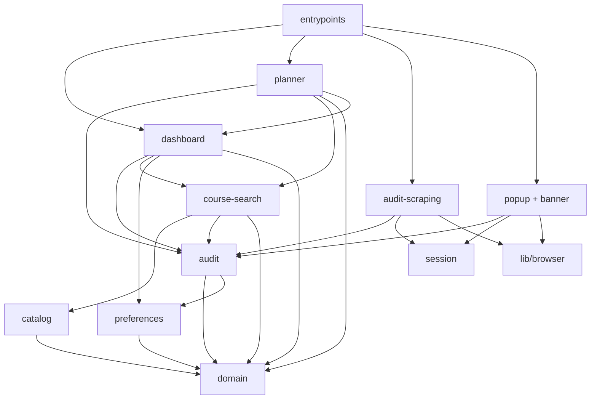
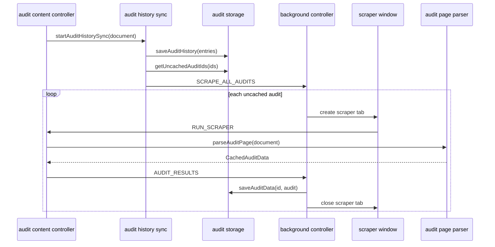
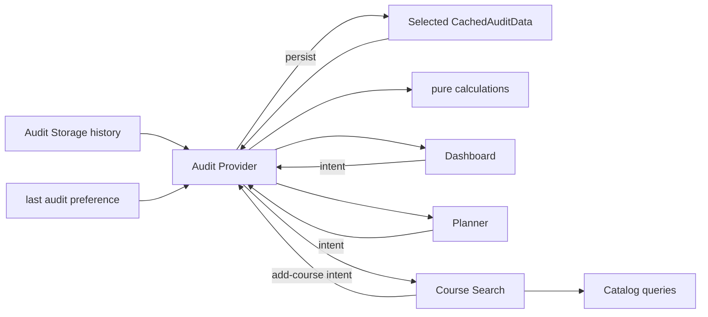

# Architecture

Degree Audit Plus uses feature-owned modules with one-way dependencies. Code
that changes for the same reason lives together; shared folders are reserved for
application vocabulary, reusable UI primitives, and the extension message
protocol.

The main state seam is `features/audit/audit-provider.tsx`. The main persisted
state seam is `features/audit/audit-storage.ts`. No separate planner store or
global state library is needed.

## Layout

```text
features/
├── audit/                  # Audit state, persistence, mutations, calculations
├── dashboard/              # Audit pages, cards, panels, graph, navigation, display groups
├── audit-scraping/         # UT audit acquisition and browser controllers
├── catalog/                # Catalog data, IndexedDB, mapping, catalog parser
│   └── scraping/           # Developer catalog-refresh parser
├── course-search/          # Audit-aware catalog search and add-course modal
├── planner/                # Planner UI and local interaction state
├── session/                # UT authentication/session knowledge
├── preferences/            # Preference persistence and React state
├── popup/                  # Popup surface and popup-only state
└── banner/                 # UT-page banner

domain/                     # Framework-free application types and semester helpers
components/ui/              # Reusable UI primitives
lib/browser/                # Typed extension message protocol
entrypoints/                # WXT registration and feature composition
scripts/catalog/            # Developer-only catalog refresh and validation
```

## Dependency direction



The important constraints are:

- Catalog is data-only. It imports domain types, Dexie, and its own files; it
  never imports Audit, Course Search, Planner, or React.
- Audit never imports Dashboard, Course Search, Planner, Popup, Banner, or
  Audit Scraping. It is a pure state/storage/mutations/calculations feature plus
  the provider seam.
- Course Search is the explicit join between Audit and Catalog. Recommendation
  functions accept audit sections as arguments and do not use React.
- Planner reuses Audit as the persisted state owner. Drag, menu, and preview
  state stay local to Planner UI.
- Audit Scraping contains no React/UI code. It writes through Audit Storage and
  uses Session for authentication knowledge.
- Features never import entrypoints. Entrypoints register controllers and
  compose providers/components; features do not depend on them.

## Feature responsibilities

### Audit

`audit-provider.tsx` loads and observes the selected audit, owns URL and
last-selected-audit fallback, derives sections/progress/courses/semesters, and
persists user intents. Its public React interface remains `AuditContextProvider`
and `useAuditContext()`.

`audit-storage.ts` is the only owner of audit browser-storage details. It owns
the existing keys and stored shapes for:

- audit history (`getAuditHistory`, `observeAuditHistory`, `saveAuditHistory`,
  `renameAudit`);
- individual audit data (`getAuditData`, `watchAuditData`, `observeAuditData`,
  `saveAuditData`, `getUncachedAuditIds`); and
- saved audit combinations (`getCachedComposites`, `createComposite`,
  `updateCachedComposite`, `deleteCachedComposite`, `loadCompositeAudit`).

`observeAuditHistory` and `observeAuditData` each hide the initial read plus
subsequent storage watch behind one cleanup function. Both prevent a delayed
initial read from overwriting a newer watched update. `observeAuditData` is the
provider's single writer of the selected audit: one effect selects the id, a
second observes its data, and no code path reads audit data alongside the
observer. This keeps a single source of truth and avoids the blank-flash that two
competing writers caused.

`audit-mutations.ts` contains immutable, browser-free changes to cached audit
data: add, remove, wipe, and move planned courses. `audit-calculations.ts`
contains side-effect-free composite/progress calculations.

### Dashboard

`features/dashboard/` owns the audit-viewing surface: pages, cards, panels, the
donut graph, and navigation chrome. `section-groups.ts` lives here — the pure
mapping from calculated sections to dashboard display groups is dashboard
vocabulary.

Dashboard may consume Audit, Preferences, Course Search, domain types, and shared
UI utilities. It never reads browser storage directly. Planner reuses the
dashboard-owned degree side panel because that panel displays audit progress; the
dependency remains one-way and Dashboard does not import Planner.

### Audit Scraping

- `audit-page-parser.ts` converts one UT audit result document to
  `CachedAuditData`.
- `audit-history-parser.ts` converts history HTML to `AuditHistoryEntry[]`.
- `parse-major.ts` owns UT program-name normalization.
- `audit-history-sync.ts` fetches, parses, stores, and observes audit history,
  then requests uncached audit scrapes.
- `content-controller.ts` responds to content-script messages, parses the
  visible result page, and records visible login state.
- `background-controller.ts` coordinates scrape batches, timeouts, result
  persistence, sync status, dashboard opening, and new-audit runs.
- `scraper-window.ts` hides minimized window/tab creation, page-load waiting,
  messaging, and cleanup.

Login-page recognition is intentionally not in a parser. It belongs to Session.

### Catalog and Course Search

Catalog owns the bundled course data and its IndexedDB representation:

- `catalog-db.ts` owns the Dexie schema and catalog queries.
- `seed-catalog.ts` versions and seeds IndexedDB from the bundled JSON.
- `department-map.ts` is static department data.
- `catalog-course-mappers.ts` contains pure preview/planned-course transforms,
  filtering, and deduplication.
- `scraping/catalog-parser.ts` parses UT catalog HTML for the developer refresh
  workflow in `scripts/catalog/`.

Course Search owns the audit-aware user flow:

- `course-recommendations.ts` joins audit requirements to Catalog queries using
  plain function arguments.
- `course-modal-provider.tsx` owns modal scope, recommendations, and loading
  state, and receives current sections from Audit.
- The remaining files render search results and the add-course flow. They call
  Audit Provider intents rather than accessing audit storage.

This split avoids an Audit ↔ Catalog dependency cycle: Dashboard can open Course
Search, Course Search can read Audit and Catalog, and Catalog remains
independent.

### Planner

Planner has no storage or provider of its own. Persisted courses and semesters
remain in Audit Provider; temporary DnD and menu state remains in Planner UI.
Substantial future pure logic such as prerequisite validation or semester-load
calculation may earn a planner calculation module, but no abstraction is added
until that logic exists.

### Session and Preferences

`session/session.ts` is the only owner of UT authentication knowledge: the login
cache, probe URL, cookie name/watch, login-page recognition, and login-tab
opening. Popup and Audit Scraping consume this interface rather than knowing UT
session details.

`preferences-storage.ts` owns preference keys, defaults, and typed WXT storage
items. `preferences-provider.tsx` owns the React state and document theme for
sidebar, luminosity, view mode, and last-selected audit.

### Popup and Banner

Popup owns popup-only presentation state such as `showAll`, `runningAudit`, login
presentation, and sync indicators. Banner owns only its open/closed state and
the first available audit ID. Both receive history through Audit Storage; they do
not duplicate persistence logic.

## Runtime data flows

### Audit acquisition



### Dashboard state



Only canonical audit data is stored. Requirements, progress, course maps, and
semester groups are derived in the provider so views do not maintain competing
copies of the same state.

## Shared code and entrypoints

`domain/` contains plain TypeScript vocabulary and semester helpers with no
React, browser, storage, or Dexie dependencies. `components/ui/` contains only
genuinely reusable UI primitives. `lib/browser/messages.ts` owns the typed
extension message union and send/response helpers.

Entrypoints stay thin:

- `background.ts` registers the Audit background controller.
- `content.tsx` starts the Audit content controller and mounts the UT-page
  banner.
- `degree-audit/main.tsx` seeds Catalog, composes Preferences → Audit → Course
  Search providers, and selects Audit versus Planner view.
- `popup-app/main.tsx` creates the popup root and renders Popup.

## Adding functionality

Start in the feature whose vocabulary and state the change belongs to. Add pure
logic beside that feature's existing calculations/mutations when possible, put
persistence behind its storage interface, and keep temporary interaction state
local to the UI. A new cross-feature module is justified only when it represents
a real user workflow, as Course Search does between Audit and Catalog.

Tests mirror ownership: audit state/storage tests live in `tests/audit`, browser
controller tests in `tests/audit-scraping`, parser snapshots in `tests/scraping`,
and catalog refresh tests in `tests/catalog`. Standalone validation scripts cover
major parsing, requirement progress, composite loading, and saved combinations.
