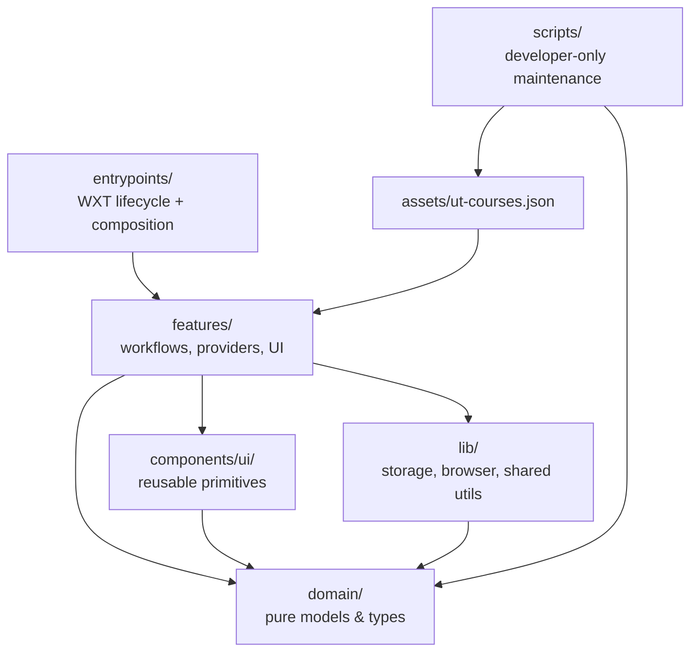
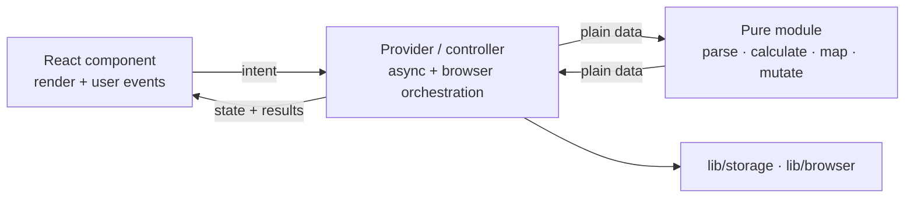
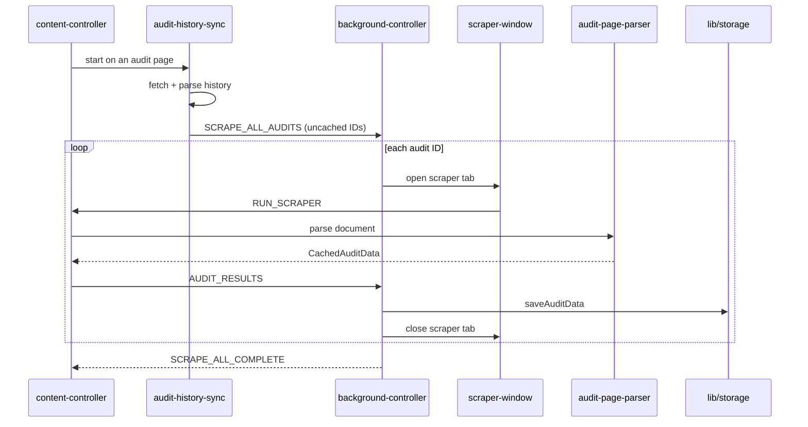
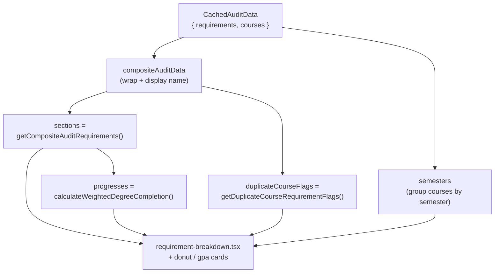
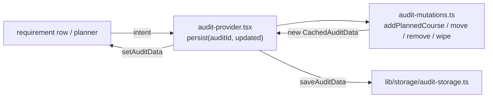
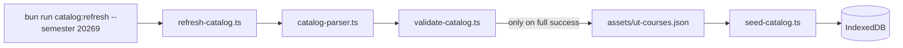

# Architecture

This document describes how UT Degree Audit Plus is organized today. It reflects
the structure produced by the cleanup described in
[`docs/CLEANUP_BACKLOG.md`](docs/CLEANUP_BACKLOG.md), which has been implemented.
Where this document and the backlog disagree, this document describes reality and
the backlog explains the original intent and reasoning.

## Guiding principle

Dependencies point in one direction: **outer layers know about inner layers, never
the reverse.**



Concretely:

- **`entrypoints/`** contain only WXT lifecycle registration and top-level React
  composition. No parsing, no business logic.
- **`features/`** own application workflows: providers, controllers, pure logic
  modules, and the React components for each feature.
- **`domain/`** holds plain TypeScript models and types with **no** dependency on
  React, WXT, DnD Kit, Dexie, storage, or browser APIs.
- **`lib/`** holds persistence, the typed message protocol, and shared helpers.
- **`scripts/`** are developer-only maintenance commands that never ship in the
  extension bundle.

## Top-level layout

```text
Degree-Audit-Plus/
├── assets/                 # ut-courses.json (bundled catalog seed), images, svgs
├── components/ui/          # reusable, cross-feature primitives
├── domain/                 # pure models & types (no framework deps)
├── entrypoints/            # WXT entrypoints + React composition roots
├── features/               # application workflows and UI, grouped by concern
├── lib/                    # storage, browser messaging, shared utils
├── scripts/catalog/        # developer catalog-refresh workflow
└── tests/                  # snapshot, unit, and validation tests + fixtures
```

## Domain models (`domain/`)

Split by concern, framework-free:

| File          | Owns                                                                 |
| ------------- | -------------------------------------------------------------------- |
| `course.ts`   | `Course`, `CourseId` (a `string`), `CourseCode`, statuses, semesters, `CoreArea` |
| `audit.ts`    | `CachedAuditData`, `AuditRequirement`, `RequirementRule`, composite + history types |
| `catalog.ts`  | Catalog course/section types                                         |
| `progress.ts` | `Progress`, `PlannableProgress`, `CurrentAuditProgress`, `RequirementProgressUnit` |

`CourseId` is a plain `string`, so the domain no longer depends on DnD Kit.
`CachedAuditData` is the single canonical audit object — `{ name?, requirements,
courses }` — from which views (sections, semesters, progress) are derived rather
than duplicated.

## Features (`features/`)

Each feature is a self-contained slice: pure logic modules alongside a
provider/controller for orchestration, with a `components/` subfolder for its UI.

```text
features/
├── audit/
│   ├── audit-provider.tsx        # canonical CachedAuditData state + intents
│   ├── audit-mutations.ts        # pure add/remove/move/wipe planned courses
│   ├── degree-audit-page.tsx
│   └── components/               # cards, donut, breakdown, graph, sidebar, navbar…
│
├── audit-scraping/
│   ├── audit-page-parser.ts      # pure DOM → CachedAuditData
│   ├── audit-history-parser.ts   # pure history HTML → entries
│   ├── audit-history-sync.ts     # fetch + parse history, request uncached scrapes
│   ├── content-controller.ts     # content-script message handling
│   ├── background-controller.ts  # batch queue, timeouts, tab cleanup, handlers
│   ├── scraper-window.ts         # scraper tab/window management
│   └── parse-major.ts
│
├── catalog/
│   ├── catalog-db.ts             # Dexie/IndexedDB access
│   ├── catalog-course-mappers.ts # pure conversion/dedup
│   ├── seed-catalog.ts           # seeds IndexedDB from bundled asset
│   ├── department-map.ts
│   ├── course-modal-provider.tsx # orchestrates course search/add
│   ├── components/               # course-add-modal, search UI
│   └── scraping/catalog-parser.ts # pure catalog HTML → CatalogCourse[]
│
├── planner/                      # degree-planner-page + course/semester components
├── popup/                        # popup-app + popup-audit-card
├── preferences/                  # preferences-provider (view mode, sidebar, last audit)
└── banner/                       # try-dap-banner
```

### The three roles

Complex features separate three responsibilities (see the backlog's
"Logic and UI boundaries" section for the full rationale):



For example, `audit-provider.tsx` is the boundary: it holds one `CachedAuditData`,
calls pure functions in `audit-mutations.ts`, persists via `lib/storage`, and hands
results to components. Small display-only components stay self-contained — a
one-use expression does not get its own hook or logic file.

Components may import pure formatting/calculation helpers, but must not import
IndexedDB, browser storage, or messaging directly **unless the component is itself
the explicit application boundary** (e.g. `course-add-modal.tsx`, which imports the
catalog search directly by design).

## Entrypoints (`entrypoints/`)

Entrypoints are thin. Logic lives in features.

| Entrypoint               | Responsibility                                                        |
| ------------------------ | --------------------------------------------------------------------- |
| `background.ts`          | `defineBackground(registerAuditBackgroundController)` — registration only |
| `content.tsx`            | Content-script lifecycle: seed DB, load fonts, mount banner, start the audit content controller |
| `popup-ui.content.tsx`   | Injected popup UI on the audit site                                   |
| `degree-audit/main.tsx`  | Composition root for the full-page dashboard                          |
| `popup-app/`             | Standalone popup app root                                             |
| `styles/`                | Injected content CSS                                                  |

`degree-audit/main.tsx` shows the provider composition:

```tsx
<PreferencesProvider>
  <AuditContextProvider>
    <CourseModalContextProvider>
      {/* Sidebar + audit/planner views */}
    </CourseModalContextProvider>
  </AuditContextProvider>
</PreferencesProvider>
```

## Runtime audit scraping

Parsing and orchestration are kept separate: pure parsers turn DOM into domain
objects, and controllers own browser events and the batch queue.



`background-controller.ts` (`AuditBatchController`) owns the queue: it runs one
batch at a time, times out unresponsive scrapes, logs a completion summary, warns
if a second batch arrives mid-run, and cleans up tabs/windows in a `finally`.

### How a page is parsed

`audit-page-parser.ts` is pure: it takes a `document` and returns a
`CachedAuditData`. It does two passes over the audit HTML:

1. **`scrapeCourseworkTable`** reads the coursework table into a
   `Record<CourseId, Course>`. Each row yields a course with a code, name, hours,
   semester (`parseSemesterFromHeader`), grade, `status` (`getStatus` →
   Completed / In Progress / Not Started), and completion method. IDs are minted
   via an injectable factory (production uses `crypto.randomUUID`; tests inject a
   sequential factory so snapshots stay deterministic).
2. **`scrapeRequirementSections`** reads each requirement block into an
   `AuditRequirement { title, rules[] }`. Each `RequirementRule` records its text,
   `requiredHours` / `appliedHours` / `remainingHours` (`parseHours`,
   `parseRequirementProgress`), a `progressUnit` of `"hours"` or `"courses"`, a
   `status`, and the **list of `CourseId`s** that satisfy it.

The crucial link is that rules reference courses **by ID**, so one course can
satisfy multiple rules and the requirement view can resolve each rule's courses
back out of the `courses` map. `checkLoginRequired` short-circuits to an
`AUTH_REQUIRED` failure when the page is a login redirect.

## Displaying requirements and the breakdown

The dashboard never renders the raw scraped audit directly. `audit-provider.tsx`
holds the single `CachedAuditData` and **derives** everything the UI shows with
`useMemo`, so state stays canonical and views stay consistent:



The derivation logic lives in `lib/audit-calculations.ts` (pure functions):

- **`getCompositeAuditRequirements`** flattens one or more audits into a single
  requirement list, attaching the source audit's display name and any
  `duplicateCourseCodes` to each requirement.
- **`getDuplicateCourseRequirementFlags`** finds course codes that satisfy
  requirements across *more than one* audit (relevant for double-counting between
  a major and a minor), by walking `rule.courses` back to their `Course`.
- **`calculateWeightedDegreeCompletion`** produces `{ current, planned, total }`
  per section and overall:
  - `total` = sum of each rule's `requiredHours`.
  - `current` = sum of each rule's `appliedHours` (what the audit already counts).
  - `planned` = hours (or course count, when `progressUnit === "courses"`) from
    courses the user marked **Planned**, **capped at the rule's remaining hours**
    so an over-planned rule can't exceed 100%.
  - Sections whose title contains `"gpa"` are excluded from the completion totals
    (GPA is reported separately, not as degree progress).

### Rendering a requirement row

`requirement-breakdown.tsx` turns each derived requirement into rows. Its display
logic is small and local:

- `getRequirementCompletionState(current, total)` → `completed` when
  `current >= total`, `not-started` when `current <= 0`, otherwise `in-progress`,
  which selects the status icon and color.
- `getSharedProgressUnit` picks a label unit: if every rule uses the same
  `progressUnit` it shows `"hours"`/`"courses"`, otherwise it falls back to a
  neutral `"progress"` label.
- `formatProgressSummary` renders e.g. `"9 / 12 hours"` or `"2 / 3 courses"`.

The row can add a planned course to a specific rule via the course modal, which is
where the planning flow begins.

## Planning: adding, moving, and removing courses

Planned-course edits are **pure functions** in `features/audit/audit-mutations.ts`.
They take a `CachedAuditData` and return a new one (or `null`); they never touch
storage or React. The provider is the only orchestrator:



- `addPlannedCourse` locates the target requirement + rule by title, mints a
  `CourseId`, appends it to that rule's `courses`, and adds the `Course` to the map.
- `removePlannedCourse` / `wipePlannedCourses` only remove courses whose status is
  `Planned`, and strip their IDs from every rule.
- `moveCourseToSemester` rewrites a course's `semester`.

Because the same new `CachedAuditData` is both persisted (`saveAuditData`) and set
as state (`setAuditData`), storage and the UI can never diverge — and semester
moves survive a reload rather than living only in memory.

## Storage and messaging (`lib/`)

Storage is split by stored entity:

```text
lib/storage/
├── audit-storage.ts        # audit history + per-audit CachedAuditData
├── composite-storage.ts    # saved composite audits
└── preferences-storage.ts  # user preferences
```

Persistence and React converge on the same result: a pure mutation produces an
updated `CachedAuditData`, which is both saved and set as state, rather than
implementing the change twice. Semester moves are persisted, not held only in
memory.

Cross-context communication uses a single typed discriminated union in
`lib/browser/messages.ts` (`ExtensionMessage`) with typed response mapping via
`MessageResponses`, replacing untyped payload casts. Senders use
`sendRuntimeMessage` / `sendTabMessage`; responders use `sendMessageResponse`.

## Catalog refresh (`scripts/catalog/`)

Catalog scraping is a **developer** workflow, fully separate from student audit
scraping and never triggered for ordinary users.



Commands:

- `bun run catalog:refresh --semester <code>` — scrape + regenerate the bundled asset
- `bun run catalog:validate` — invariant checks on the generated asset
- `bun run catalog:departments` — regenerate the department map

The runner writes a temporary file and replaces `assets/ut-courses.json` only
after the full scrape and validation succeed, so a failed run never corrupts the
working catalog. `catalog-parser.ts` is shared between this workflow and tests.

## Tests (`tests/`)

Parsers are locked by reviewable snapshots before/after refactors; live fetching is
tested separately with mocked responses.

```text
tests/
├── fixtures/scraping/      # checked-in HTML fixtures
├── scraping/               # audit + catalog parser snapshot tests (+ __snapshots__)
├── audit/                  # audit-storage + audit-mutations unit tests
├── audit-scraping/         # background-controller tests (batch, timeout, failure)
├── catalog/                # catalog-refresh tests
└── validate-*.ts           # standalone validation scripts (bun run test:*)
```

Test entry points are wired in `package.json` (`test:scraping`, `test:catalog`,
`test:audit`, and the `validate-*` scripts). Course IDs are injectable in the
parser so object comparisons stay deterministic while production still uses
`crypto.randomUUID`.

## Where reality differs from the backlog

The backlog was a target, not a literal spec. Notable pragmatic differences:

- **Messages** kept the existing `SCREAMING_CASE` `ExtensionMessage` union (e.g.
  `SCRAPE_ALL_AUDITS`) instead of the proposed `audit/scrape` naming. The goal —
  one typed, exhaustive union — is met.
- A dedicated **`features/preferences/`** provider owns view mode, sidebar state,
  and last-audit selection.
- Catalog search orchestration lives in **`course-modal-provider.tsx`** rather than
  a standalone search hook; `course-add-modal.tsx` remains the search boundary.
- **`lib/audit-calculations.ts`** and `features/audit-scraping/parse-major.ts`
  remain in place rather than being relocated, since moving them offered churn
  without clearer boundaries.
